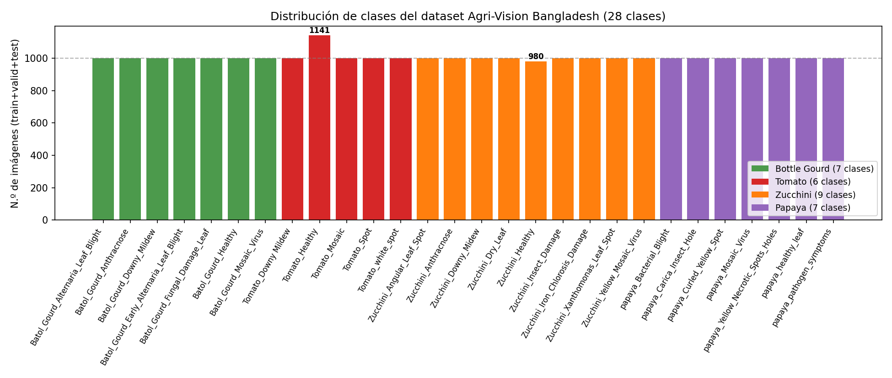
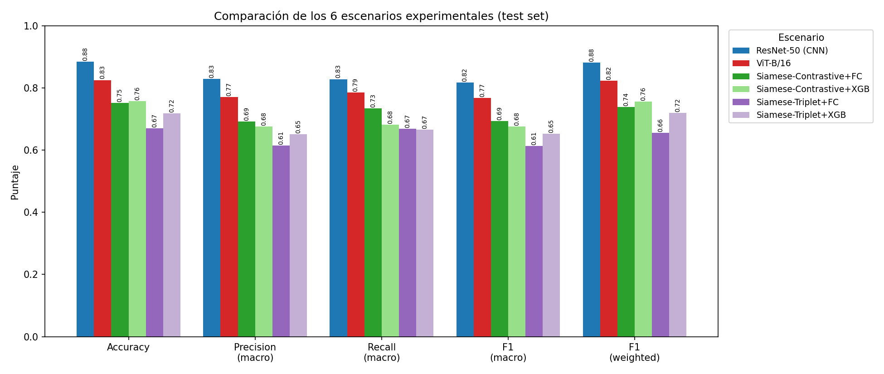
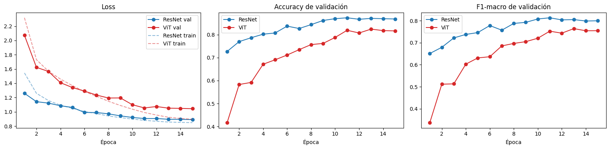
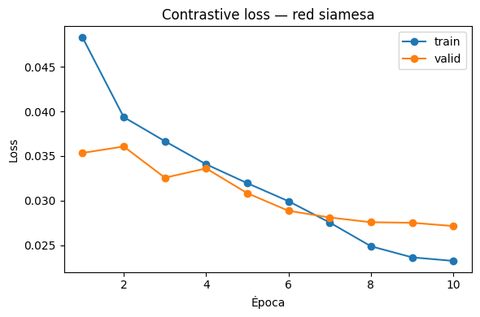
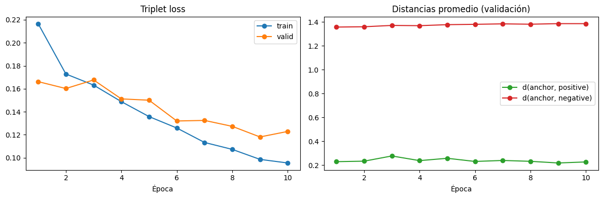
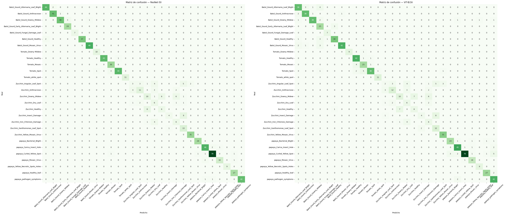
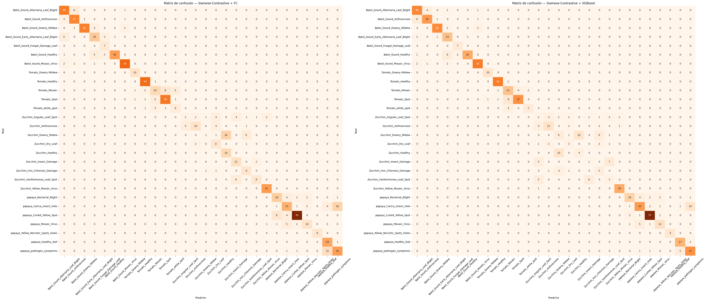
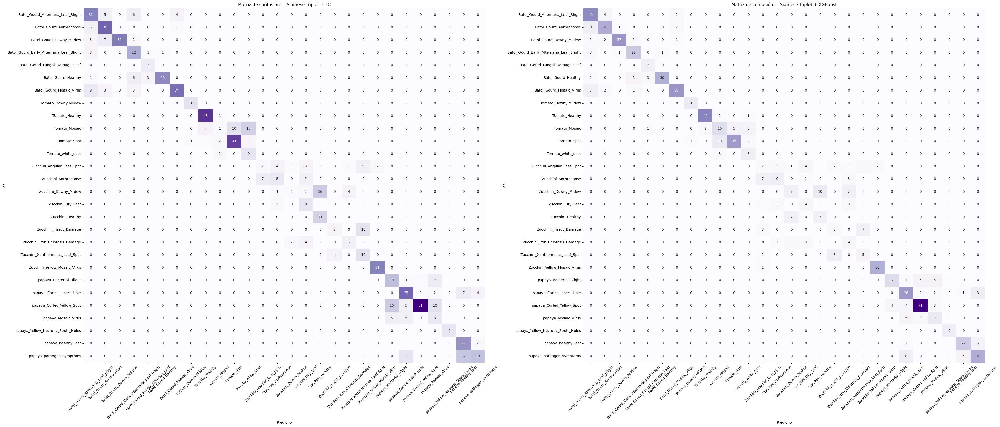

# Clasificación de hojas de cultivos mediante CNN, Vision Transformer y redes siamesas

**Curso:** _Deep Learning_
**Docente:** _Escobedo Cardenas, Edwin Jonathan_
**Fecha:** _17/07/2026_

**Integrantes:**
- Almerco Velita, Alonso Feliciano
- Montero Gutierrez, Eduardo Cristopher
- Oshiro Ugamoto, Ryuichi
- Sulca Ramirez, Rodrigo Fernando

---

## 1. Introducción

Las enfermedades foliares representan una de las principales causas de pérdida de rendimiento
en la agricultura, especialmente en cultivos hortícolas de alto valor económico como el Bottle
Gourd (*Lagenaria siceraria*), el Zucchini (*Cucurbita pepo*), la Papaya (*Carica papaya*) y el
Tomate (*Solanum lycopersicum*). En países como Bangladesh, donde estos cultivos son
fundamentales para la seguridad alimentaria y los ingresos de pequeños agricultores, el
diagnóstico temprano y preciso de enfermedades virales, fúngicas, bacterianas y daños por
plagas suele depender de la inspección visual manual por parte de agrónomos, un proceso lento,
costoso y difícil de escalar. La visión por computadora, y en particular el aprendizaje
profundo, ofrece una alternativa capaz de automatizar este diagnóstico a partir de imágenes de
hojas, acelerando la detección y facilitando intervenciones oportunas que reducen pérdidas de
cosecha.

Este trabajo aborda el problema de **clasificación automática de imágenes de hojas en 28
clases**, correspondientes a distintas combinaciones de cultivo y estado (sano o con un tipo
específico de estrés biótico), utilizando el dataset público *Agri-Vision Bangladesh* (Billah
et al., 2026, *Data in Brief*). En lugar de limitarse a una sola arquitectura, se comparan
sistemáticamente **tres familias de enfoques**: (1) *fine-tuning* end-to-end de redes
neuronales preentrenadas (una CNN clásica, ResNet-50, y un Vision Transformer, ViT-B/16); (2)
redes siamesas entrenadas con **contrastive loss** para aprender un espacio de embeddings
donde imágenes de la misma clase queden cerca y de clases distintas queden lejos; y (3) redes
siamesas entrenadas con **triplet loss** con el mismo objetivo pero mediante tripletas
ancla-positivo-negativo. Sobre los embeddings aprendidos por ambas redes siamesas se evalúan,
además, dos clasificadores distintos —una capa totalmente conectada (FC) y un modelo de
*machine learning* clásico (XGBoost)— para determinar si un clasificador no lineal aprovecha
mejor la geometría del espacio de embeddings que una simple proyección lineal.

**Objetivo general:** comparar el desempeño, el costo computacional y las limitaciones de seis
escenarios experimentales de clasificación de enfermedades foliares, para identificar qué
combinación de arquitectura, función de pérdida y clasificador ofrece el mejor equilibrio
entre precisión y eficiencia sobre el dataset Agri-Vision Bangladesh.

**Objetivos específicos** (uno por escenario, detallados en la sección 2.2):
1. Entrenar y evaluar una CNN (ResNet-50) mediante *fine-tuning* end-to-end.
2. Entrenar y evaluar un Vision Transformer (ViT-B/16) mediante *fine-tuning* end-to-end.
3. Entrenar una red siamesa con contrastive loss y evaluar una cabeza FC sobre el backbone
   congelado.
4. Usar los embeddings de la misma red siamesa contrastive para entrenar y evaluar un
   clasificador XGBoost.
5. Entrenar una red siamesa con triplet loss y evaluar una cabeza FC sobre el backbone
   congelado.
6. Usar los embeddings de la misma red siamesa triplet para entrenar y evaluar un clasificador
   XGBoost.

El resto del informe se organiza así: la sección 2 describe el dataset y el protocolo
experimental común a los seis escenarios; la sección 3 presenta los resultados de test de cada
escenario y los discute en conjunto (CNN vs. ViT, contrastive vs. triplet, FC vs. XGBoost,
fine-tuning vs. backbone congelado, y un análisis de las clases más difíciles de clasificar);
y la sección 4 resume las conclusiones, limitaciones del estudio y posibles líneas de trabajo
futuro.

---

## 2. Metodología

### 2.1 Descripción del dataset

| Característica | Detalle |
|---|---|
| Fuente | Billah, M.M., Rahman, M.A., Sagor, S., Parvin, S., & Uddin, M.S. (2026). *Agri-vision Bangladesh: A multi-crop augmented image dataset for automated disease diagnosis in Bottle Gourd, Zucchini, Papaya, and Tomato*. Data in Brief, 65, 112528. https://doi.org/10.1016/j.dib.2026.112528 |
| Dominio | Imágenes de hojas de Bottle Gourd (*Lagenaria siceraria*), Zucchini (*Cucurbita pepo*), Papaya (*Carica papaya*) y Tomate (*Solanum lycopersicum*), fotografiadas en campos agrícolas de Bangladesh (cámara SONY ALPHA 7 II, luz natural) |
| N.º de clases | 28 (estrés biótico viral, fúngico, bacteriano y por plagas, más muestras sanas) |
| N.º de imágenes totales | 28,000 según el artículo (5,266 originales + 22,734 aumentadas mediante rotación, flips, ruido y brillo) — en nuestro split (`Dataset_split_Aug/`) se cuentan 28,121 imágenes (train: 26,536 · valid: 772 · test: 813); la pequeña diferencia puede deberse a aumentos adicionales aplicados localmente |
| Resolución original | 512×512 px, estandarizada en JPG según el artículo original (en la copia local del dataset se observan además algunos archivos PNG y de otras resoluciones, posiblemente de una etapa de aumento adicional) |
| Formato | JPG (mayoría, 23,545 archivos) y PNG (2,991 archivos) |
| Validación | Cada imagen fue revisada en un proceso de dos etapas por agrónomos senior (según el artículo original) |
| Split | 70 % train / 15 % valid / 15 % test (`split_dataset.ipynb`, generado en `Dataset_split_Aug/`) |

**Listado de clases** (obtenido de `CLASS_NAMES` en `clasificacion_hojas_siamese_triplet.ipynb`):

`Batol_Gourd_Alternaria_Leaf_Blight`, `Batol_Gourd_Anthracnose`, `Batol_Gourd_Downy_Mildew`,
`Batol_Gourd_Early_Alternaria_Leaf_Blight`, `Batol_Gourd_Fungal_Damage_Leaf`,
`Batol_Gourd_Healthy`, `Batol_Gourd_Mosaic_Virus`, `Tomato_Downy Mildew`, `Tomato_Healthy`,
`Tomato_Mosaic`, `Tomato_Spot`, `Tomato_white_spot`, `Zucchini_Angular_Leaf_Spot`,
`Zucchini_Anthracnose`, `Zucchini_Downy_Midew`, `Zucchini_Dry_Leaf`, `Zucchini_Healthy`,
`Zucchini_Insect_Damage`, `Zucchini_Iron_Chlorosis_Damage`, `Zucchini_Xanthomonas_Leaf_Spot`,
`Zucchini_Yellow_Mosaic_Virus`, `papaya_Bacterial_Blight`, `papaya_Carica_Insect_Hole`,
`papaya_Curled_Yellow_Spot`, `papaya_Mosaic_Virus`, `papaya_Yellow_Necrotic_Spots_Holes`,
`papaya_healthy_leaf`, `papaya_pathogen_symptoms`

**Distribución de clases:**

El dataset está **casi perfectamente balanceado**: 26 de las 28 clases tienen exactamente
1,000 imágenes; las únicas excepciones son `Tomato_Healthy` (1,141) y `Zucchini_Healthy`
(980). Esto descarta el desbalance de clases como causa de las dificultades observadas en
ciertas clases de Zucchini (sección 3.6) — la dificultad es por similitud visual entre
enfermedades, no por falta de datos de entrenamiento.

**Preprocesamiento y aumento de datos:**
- Redimensionado a 224×224 px (requerido por ResNet-50 y ViT-B/16 preentrenados en ImageNet).
- Normalización con media/desviación estándar de ImageNet.
- Aumentos aplicados solo en entrenamiento: `RandomResizedCrop`, flips horizontal/vertical,
  rotación aleatoria (±20°), *color jitter*.

### 2.2 Protocolo experimental

Se evaluaron **6 escenarios** de clasificación sobre el mismo split de datos, todos usando
*transfer learning* con pesos preentrenados en ImageNet como punto de partida:

| # | Escenario | Notebook | Descripción |
|---|---|---|---|
| 1 | CNN (ResNet-50) | `clasificacion_hojas_resnet_vs_vit.ipynb` | Fine-tuning end-to-end de ResNet-50 con cabeza lineal de 28 clases. |
| 2 | Vision Transformer (ViT-B/16) | `clasificacion_hojas_resnet_vs_vit.ipynb` | Fine-tuning end-to-end de ViT-B/16 con cabeza lineal de 28 clases. |
| 3 | Siamesa + Contrastive Loss + FC | `clasificacion_hojas_siamese_contrastive.ipynb` | Backbone ResNet-50 entrenado con contrastive loss sobre pares (misma clase / distinta clase); luego se congela y se entrena una capa FC para las 28 clases. |
| 4 | Siamesa + Contrastive Loss + XGBoost | `clasificacion_hojas_siamese_contrastive.ipynb` | Mismo backbone congelado del escenario 3, usado para extraer embeddings; se entrena un clasificador XGBoost sobre esos vectores. |
| 5 | Siamesa + Triplet Loss + FC | `clasificacion_hojas_siamese_triplet.ipynb` | Backbone ResNet-50 (independiente) entrenado con triplet loss (anchor/positive/negative); luego se congela y se entrena una capa FC para las 28 clases. |
| 6 | Siamesa + Triplet Loss + XGBoost | `clasificacion_hojas_siamese_triplet.ipynb` | Mismo backbone congelado del escenario 5, usado para extraer embeddings; se entrena un clasificador XGBoost sobre esos vectores. |

**Detalles comunes a todos los escenarios:**
- Arquitectura base: ResNet-50 preentrenado en ImageNet (`ResNet50_Weights.IMAGENET1K_V2`).
- ViT-B/16 preentrenado en ImageNet (`ViT_B_16_Weights.IMAGENET1K_V1`) solo en el escenario 2.
- Optimizador: AdamW, *weight decay* = 1e-4.
- *Scheduler*: Cosine Annealing.
- Precisión mixta (AMP) cuando hay GPU disponible.
- Selección de mejor modelo por F1-macro (clasificadores) o menor pérdida de validación
  (redes siamesas) durante el entrenamiento.
- Semilla fija (`SEED = 42`) para reproducibilidad.

**Particularidades de las redes siamesas (escenarios 3-6):**
- Dimensión del embedding: 128, normalizado L2.
- Margen: 1.0 (igual en contrastive y triplet, para que ambos escenarios sean comparables).
- Contrastive loss: pares 50 % misma clase / 50 % clase distinta.
- Triplet loss: tripletas (anchor, positive de la misma clase, negative de clase distinta).
- En las Tareas A (FC) de ambos, el backbone queda **congelado** (incluyendo estadísticas de
  BatchNorm) y solo se entrena la capa de clasificación final, tal como exige la consigna.
- En las Tareas B (XGBoost), los embeddings se extraen sin aumento de datos, con `XGBClassifier`
  (`n_estimators=300`, `max_depth=6`, `learning_rate=0.05`, *early stopping* sobre el set de
  validación).

### 2.3 Métricas de evaluación

Para cada escenario, evaluado sobre el conjunto de **test** (nunca visto durante entrenamiento
ni selección de hiperparámetros):

- Accuracy
- Precision macro y ponderada (weighted)
- Recall macro
- F1-score macro y ponderado
- Matriz de confusión y reporte por clase
- Tiempo de entrenamiento y número de parámetros entrenables (para discutir costo
  computacional vs. desempeño)

---

## 3. Resultados y discusión

### 3.1 Tabla comparativa de los 6 escenarios

Valores de test de los 6 escenarios (fuente: `comparacion_metricas.csv`,
`comparacion_metricas_siamese_contrastive.csv` y `comparacion_metricas_siamese_triplet.csv` en
`checkpoints/`). El tiempo de entrenamiento de los escenarios siamese-* corresponde solo al
clasificador final (FC o XGBoost) sobre el backbone ya congelado; no incluye el tiempo de
entrenar el backbone siamés en sí (ver sección 3.3).

| Modelo | Accuracy | Precision (macro) | Recall (macro) | F1 (macro) | F1 (weighted) | Tiempo entren. clasificador (min) | Parámetros entrenables (M) |
|---|---|---|---|---|---|---|---|
| ResNet-50 (CNN) | 0.8844 | 0.8284 | 0.8283 | 0.8176 | 0.8814 | 87.45 | 23.5654 |
| ViT-B/16 | 0.8253 | 0.7713 | 0.7853 | 0.7683 | 0.8226 | 88.38 | 85.8202 |
| Siamese-Contrastive + FC | 0.7515 | 0.6916 | 0.7348 | 0.6937 | 0.7391 | 88.41 | 0.0036 |
| Siamese-Contrastive + XGBoost | 0.7577 | 0.6760 | 0.6822 | 0.6754 | 0.7564 | 0.20 | — |
| Siamese-Triplet + FC | 0.6704 | 0.6143 | 0.6688 | 0.6135 | 0.6560 | 91.67 | 0.0036 |
| Siamese-Triplet + XGBoost | 0.7183 | 0.6514 | 0.6657 | 0.6525 | 0.7202 | 0.14 | — |

**Ranking por F1-macro (mejor a peor):** ResNet-50 (0.8176) > ViT-B/16 (0.7683) >
Siamese-Contrastive + FC (0.6937) > Siamese-Contrastive + XGBoost (0.6754) >
Siamese-Triplet + XGBoost (0.6525) > Siamese-Triplet + FC (0.6135).

### 3.2 CNN vs. ViT (fine-tuning end-to-end)

Ambos se entrenaron 15 épocas con AdamW + cosine annealing, sobre GPU (NVIDIA RTX 6000 Ada).
**ResNet-50 superó claramente a ViT-B/16** en las cinco métricas de test: accuracy 0.8844 vs.
0.8253 (+5.9 pp), F1-macro 0.8176 vs. 0.7683 (+4.9 pp), F1-weighted 0.8814 vs. 0.8226
(+5.9 pp). Ambos tardaron prácticamente lo mismo en entrenar (87.4 vs. 88.4 min), pero ViT
tiene **3.6× más parámetros entrenables** (85.8 M vs. 23.6 M) — es decir, con más costo de
memoria y cómputo por *forward pass*, ViT rindió peor en este dataset. Esto es consistente con
lo esperado para datasets de tamaño mediano (~26.5 K imágenes de entrenamiento): los ViT
carecen del sesgo inductivo convolucional y suelen necesitar más datos o más épocas de
fine-tuning para igualar a una CNN preentrenada equivalente.

En las curvas de validación, ResNet-50 convergió más rápido y de forma más estable (val_f1
0.651 en la época 1, 0.813 en la época 11) que ViT-B/16 (val_f1 0.337 en la época 1, 0.764 en
la época 15, aún sin aplanarse del todo) — con más épocas, ViT podría cerrar parte de la
brecha, pero no alcanzó a ResNet-50 en las 15 épocas entrenadas.

**Clases más difíciles en ambos modelos:** `Zucchini_Angular_Leaf_Spot` es la peor clase tanto
en ResNet-50 (F1 0.23) como en ViT-B/16 (F1 0.16), seguida de varias otras clases de Zucchini
(`Dry_Leaf`, `Downy_Midew`, `Healthy`, `Insect_Damage`, `Iron_Chlorosis_Damage`, todas con
F1 entre 0.41 y 0.61 en ambos modelos). En cambio, ambos modelos clasifican casi perfectamente
clases como `Batol_Gourd_Fungal_Damage_Leaf`, `Tomato_white_spot` y
`papaya_Yellow_Necrotic_Spots_Holes` (F1 ≥ 0.90-1.00). El patrón de errores es muy similar
entre ambas arquitecturas, lo que sugiere que la dificultad está en el propio dataset
(similitud visual entre subtipos de Zucchini) más que en la arquitectura elegida — y no se
debe a desbalance de clases, ya que el dataset está casi perfectamente balanceado (~1,000
imágenes por clase, sección 2.1).

### 3.3 Redes siamesas: contrastive vs. triplet

**Contrastive:** la red se entrenó 10 épocas (53,072 pares/época, 1659 batches de 32) durante
**879.3 min** (~14.7 h). La pérdida de entrenamiento bajó de 0.0483 (época 1) a 0.0232
(época 10), y la de validación de 0.0353 a 0.0271 (mejor checkpoint en la época 10). La
*pair-accuracy* de validación (clasificar el par como similar/disimilar según un umbral)
subió de 90.6 % a 92.9 %. La distancia promedio en el set fijo de validación fue **0.1604**
para pares de la misma clase y **0.9985** para pares de clases distintas.

**Triplet:** la red se entrenó 10 épocas (53,072 tripletas/época) durante **1326.4 min**
(~22.1 h, ≈1.5× más que contrastive). La pérdida de entrenamiento bajó de 0.2166 a 0.0954, y
la de validación de 0.1662 a 0.1181 (mejor checkpoint en la época 9). La distancia intra-clase
promedio final fue **0.2271** (d(a,p)) y la inter-clase **1.3864** (d(a,n)), con una
*triplet-accuracy* de validación (`d(a,p) < d(a,n)`) de ~97 %.

| Métrica | Contrastive | Triplet |
|---|---|---|
| Tiempo de entrenamiento (backbone) | 879.3 min | 1326.4 min |
| Distancia intra-clase (val) | 0.1604 | 0.2271 |
| Distancia inter-clase (val) | 0.9985 | 1.3864 |
| Ratio inter/intra | ~6.2× | ~6.1× |
| Métrica de acierto en validación | pair-acc 92.9 % | triplet-acc ~97 % |

**Discusión:** ambas funciones de pérdida lograron separar bien las clases (la distancia
inter-clase es 6 veces mayor que la intra-clase en los dos casos), pero triplet lo consiguió
en un espacio embebido con mayor dispersión absoluta (distancias más grandes en valor
absoluto, ya que compara relativamente anchor-positivo vs. anchor-negativo en lugar de
imponer un margen fijo por par) y con mejor *accuracy* de separación en validación (~97 % vs.
~93 %). Sin embargo, **contrastive fue notablemente más rápido de entrenar** (879 min vs.
1326 min, ~1.5× más lento en triplet) porque no necesita muestrear una tercera imagen (negativo)
por cada ejemplo. Pese a que triplet separó mejor las clases según sus propias métricas de
distancia, esto **no se tradujo en mejores embeddings para clasificación downstream**: como se
ve en la sección 3.1, ambos clasificadores (FC y XGBoost) sobre embeddings *contrastive*
superaron a sus equivalentes sobre embeddings *triplet* (p. ej. FC: F1-macro 0.6937 vs. 0.6135;
XGBoost: F1-macro 0.6754 vs. 0.6525). Esto sugiere que una mayor separación por pares/tripletas
en el espacio de embeddings no garantiza necesariamente una mejor separabilidad lineal/por
árboles para las 28 clases del problema real.

### 3.4 Clasificador FC vs. XGBoost sobre los mismos embeddings

**Triplet:** sobre exactamente los mismos embeddings (128-d, backbone congelado), XGBoost
superó a la capa FC en todas las métricas de test: accuracy 0.7183 vs. 0.6704 (+4.8 pp),
F1-macro 0.6525 vs. 0.6135 (+3.9 pp) y F1-weighted 0.7202 vs. 0.6560 (+6.4 pp). Además, el
costo de entrenamiento de XGBoost fue drásticamente menor (8.2 s, 132 iteraciones con *early
stopping*) frente a los ~92 min de la capa FC (10 épocas sobre 26,536 imágenes). Esto sugiere
que, para este espacio de embeddings, un clasificador no-lineal basado en árboles aprovecha
mejor la geometría de los embeddings triplet que una simple proyección lineal, y lo hace con
un costo de entrenamiento órdenes de magnitud menor (aunque la extracción de embeddings en sí
—forward pass del backbone— sí requiere GPU/tiempo considerable, no reflejado en el tiempo de
XGBoost).

**Contrastive:** aquí el resultado es mixto. XGBoost tuvo mejor accuracy (0.7577 vs. 0.7515,
+0.6 pp) y F1-weighted (0.7564 vs. 0.7391, +1.7 pp), pero la capa FC tuvo mejor F1-macro
(0.6937 vs. 0.6754) y mejor recall-macro (0.7348 vs. 0.6822). Es decir, XGBoost predice mejor
en promedio ponderado por soporte (clases mayoritarias), pero la FC generaliza algo mejor
entre clases minoritarias (macro). Esto contrasta con el escenario triplet, donde XGBoost
ganó en las cuatro métricas sin ambigüedad. Al igual que en triplet, XGBoost fue drásticamente
más rápido de entrenar (0.20 min vs. 88.41 min).

**Conclusión de esta comparación:** XGBoost es preferible quirúrgicamente por velocidad de
entrenamiento del clasificador final en ambos escenarios, y por desempeño global en triplet;
en contrastive, la elección entre FC y XGBoost depende de si interesa más el desempeño
promedio (weighted → XGBoost) o el desempeño equilibrado entre todas las clases
(macro → FC).

### 3.5 Comparación global: fine-tuning end-to-end vs. redes siamesas + clasificador congelado

El fine-tuning end-to-end (CNN y ViT) superó a todos los escenarios siamesa en F1-macro y
accuracy: ResNet-50 (F1-macro 0.8176) supera al mejor escenario siamés
(Siamese-Contrastive + FC, F1-macro 0.6937) por **+12.4 puntos porcentuales**. Esto tiene
sentido: en los escenarios 1-2 todos los pesos del backbone se ajustan directamente para la
tarea de clasificación de 28 clases, mientras que en 3-6 el backbone se entrena con una señal
distinta (separar pares o tripletas) y luego se congela — el clasificador final solo puede
aprovechar la información que el espacio de embeddings ya capturó, sin poder ajustar el
backbone a la tarea específica.

Además, el costo total de los escenarios siameses es mayor, no menor: entrenar el backbone
contrastive tomó 879 min y el triplet 1326 min, **antes** de entrenar el clasificador final
(88-92 min más para la FC). Es decir, el camino "red siamesa + clasificador congelado" no solo
rindió peor en este experimento, sino que también costó más tiempo total de cómputo que el
fine-tuning directo (87-88 min) de CNN/ViT.

Dicho esto, el enfoque siamés seguiría teniendo sentido en escenarios que este experimento no
cubre: cuando se necesitan **embeddings reutilizables** para otras tareas además de clasificar
estas 28 clases (búsqueda por similitud, detección de clases nuevas sin reentrenar,
*few-shot learning*), o cuando se dispone de **muchos menos datos etiquetados** por clase de
los que aquí se usaron (~950 imágenes/clase en promedio) y no es viable hacer fine-tuning
completo de una red grande. Con el volumen de datos disponible en este dataset, sin embargo,
el fine-tuning end-to-end fue la opción más eficaz y también más eficiente en cómputo.

### 3.6 Análisis por clase

**F1 en test para `Zucchini_Angular_Leaf_Spot` (la clase más débil en todos los escenarios):**

| Escenario | F1 |
|---|---|
| ResNet-50 (CNN) | 0.23 |
| ViT-B/16 | 0.16 |
| Siamese-Contrastive + FC | 0.16 |
| Siamese-Contrastive + XGBoost | 0.11 |
| Siamese-Triplet + FC | 0.15 |
| Siamese-Triplet + XGBoost | 0.12 |

`Zucchini_Angular_Leaf_Spot` es, sin excepción, **la clase con peor F1 en los 6 escenarios**
—incluyendo el fine-tuning directo de CNN/ViT—, lo que indica que la dificultad es del propio
dataset (posible solapamiento visual con `Zucchini_Anthracnose`, `Zucchini_Downy_Midew` o
`Zucchini_Xanthomonas_Leaf_Spot`) y no un problema específico de una arquitectura o función de
pérdida.

**Por escenario:**
- **ResNet-50 / ViT-B/16:** las clases más débiles en ambos son casi todas de Zucchini
  (`Angular_Leaf_Spot`, `Dry_Leaf`, `Downy_Midew`, `Healthy`, `Insect_Damage`,
  `Iron_Chlorosis_Damage`, F1 entre 0.16 y 0.61); el resto de clases (Batol Gourd, Tomato,
  Papaya) tienen F1 ≥ 0.76 en ambos modelos.
- **Siamese-Contrastive + FC:** además de Zucchini, aparecen débiles `Tomato_white_spot`
  (0.52) y `Tomato_Mosaic` (0.53), que en CNN/ViT tenían F1 ≥ 0.81 — el backbone congelado
  pierde algo de la discriminación fina que sí logra el fine-tuning completo en esas clases.
- **Siamese-Contrastive + XGBoost:** patrón similar a FC, con `Zucchini_Insect_Damage` (0.09)
  y `Zucchini_Xanthomonas_Leaf_Spot` (0.21) como adicionales más débiles.
- **Siamese-Triplet (FC y XGBoost):** mismo patrón dominado por clases de Zucchini;
  adicionalmente `Tomato_Mosaic` es muy débil en FC (F1 0.06, recall 0.03) pero se recupera
  con XGBoost (F1 0.53), sugiriendo que ahí el cuello de botella es el clasificador lineal y
  no el embedding.

**Conclusión general:** las subcategorías de **Zucchini** son consistentemente las más
difíciles de distinguir en los 6 escenarios. Como se ve en la sección 2.1, el dataset está
casi perfectamente balanceado (~1,000 imágenes/clase, con solo dos excepciones menores), por
lo que la dificultad **no se explica por desbalance de clases**, sino por similitud visual
genuina entre los síntomas de distintas enfermedades de Zucchini (varias comparten manchas o
decoloraciones foliares de apariencia parecida). El fine-tuning end-to-end (CNN/ViT) mitiga
parcialmente este problema (F1 ~0.2-0.6 en esas clases) mejor que los enfoques con backbone
congelado (F1 ~0.1-0.5), lo que es consistente con la conclusión de la sección 3.5: ajustar el
backbone completo ayuda especialmente en las clases más difíciles de separar visualmente.

---

## 4. Conclusiones

- **Mejor escenario:** ResNet-50 con fine-tuning end-to-end fue el mejor de los 6 escenarios
  (accuracy 0.8844, F1-macro 0.8176, F1-weighted 0.8814), superando incluso a ViT-B/16
  (F1-macro 0.7683) pese a usar 3.6× menos parámetros entrenables. Ajustar todos los pesos del
  backbone durante el entrenamiento de clasificación fue más efectivo que aprender primero un
  espacio de embeddings (contrastive o triplet) y clasificar sobre pesos congelados.

- **Escenario más eficiente en cómputo:** también ResNet-50 — no solo fue el más preciso, sino
  que su único costo de entrenamiento (87.4 min) fue muy inferior al costo total de cualquier
  escenario siamés, que además de entrenar el clasificador final (88-92 min) requiere entrenar
  primero el backbone (879 min en contrastive, 1326 min en triplet). Dentro de los siameses,
  XGBoost fue el clasificador final más rápido por un margen enorme (segundos vs. ~90 min de
  la capa FC), sin perder desempeño (de hecho, lo mejoró en la mayoría de métricas).

- **¿Aportó ventajas el enfoque siamés frente al fine-tuning directo?** No en este experimento:
  en las condiciones probadas (dataset de tamaño medio, ~950 imágenes/clase en promedio, sin
  restricciones de cómputo), el fine-tuning directo de CNN/ViT fue superior tanto en desempeño
  como en costo total de entrenamiento. El enfoque siamés seguiría siendo recomendable en
  escenarios que este trabajo no cubrió: pocos ejemplos etiquetados por clase, necesidad de
  embeddings reutilizables para tareas más allá de la clasificación fija (búsqueda por
  similitud, detección de clases nuevas), o cuando no es viable actualizar todos los pesos de
  un backbone grande.

- **Contrastive vs. triplet:** contrastive produjo embeddings mejores para la tarea de
  clasificación downstream (F1-macro más alto tanto con FC como con XGBoost) y fue ~1.5× más
  rápido de entrenar (879 vs. 1326 min), a pesar de que triplet logró una métrica de
  separación interna más alta (*triplet-acc* ~97 % vs. *pair-acc* ~93 %). Esto indica que una
  mejor separación según la propia función de pérdida no garantiza mejores embeddings para el
  problema de clasificación real — contrastive es la opción recomendada para este dataset,
  tanto por desempeño como por costo de entrenamiento.

- **¿XGBoost superó consistentemente a la capa FC?** Prácticamente sí: ganó en las cuatro
  métricas en triplet, y en 2 de 4 (accuracy, F1-weighted) en contrastive, siempre con un
  costo de entrenamiento del clasificador final órdenes de magnitud menor. Un clasificador no
  lineal basado en árboles aprovechó mejor la geometría de los embeddings congelados que una
  simple proyección lineal, especialmente cuando se pondera por el tamaño de cada clase
  (weighted); la capa FC mantuvo una ligera ventaja en F1-macro/recall-macro en contrastive,
  es decir, en el desempeño equilibrado entre clases minoritarias.

- **Clases problemáticas:** `Zucchini_Angular_Leaf_Spot` fue la clase con peor F1 en los 6
  escenarios sin excepción, y en general las subcategorías de Zucchini concentraron los
  peores resultados en todos los modelos. El dataset está casi perfectamente balanceado
  (~1,000 imágenes/clase, sección 2.1), por lo que este patrón **no se explica por desbalance
  de clases** — el problema es la similitud visual genuina entre distintas enfermedades de
  Zucchini, no la cantidad de datos disponibles, y afecta por igual a la arquitectura o
  función de pérdida elegida.

- **Limitaciones del estudio:** (1) el backbone siamés se entrenó en CPU (según los logs, sin
  GPU disponible en esas corridas), lo que explica los tiempos de entrenamiento de 15-22 horas
  y limitó a 10 épocas por restricciones de tiempo — con GPU y más épocas los resultados de
  contrastive/triplet podrían mejorar; (2) no se realizó búsqueda de hiperparámetros (margen,
  dimensión de embedding, arquitectura de la cabeza FC) para los escenarios siameses, se usó
  una única configuración razonable para todos; (3) aunque el dataset está bien balanceado por
  clase, el split de test deja algunas clases con muy pocas imágenes en términos absolutos
  (7-9), lo que hace sus métricas de F1 más sensibles a errores individuales y menos estables
  estadísticamente; (4) el dataset combina cuatro cultivos distintos (Batol Gourd, Tomate,
  Zucchini, Papaya) con distinto número de clases y enfermedades cada uno, lo que dificulta
  separar si los errores se deben al cultivo o a la enfermedad en sí.

- **Trabajo futuro:** repetir el entrenamiento de las redes siamesas con GPU y más épocas para
  confirmar si la brecha con CNN/ViT se cierra; probar *hard negative/positive mining* en vez
  de muestreo aleatorio de pares/tripletas (para forzar al modelo a aprender de los pares más
  difíciles, como los distintos subtipos de Zucchini); dado que el dataset ya está balanceado,
  explorar en su lugar técnicas de aumento de datos específicas para las clases de Zucchini
  (más variedad de ángulos/iluminación) o *fine-tuning* parcial del backbone siamés (descongelar
  las últimas capas) en vez de congelarlo por completo; y evaluar si aumentar la dimensión del
  embedding o afinar el margen mejora la separabilidad downstream de contrastive y triplet.

---

## Referencias

_[Formato según lo solicitado por el curso — incluir al menos:]_

1. Billah, M.M., Rahman, M.A., Sagor, S., Parvin, S., & Uddin, M.S. (2026). Agri-vision Bangladesh: A multi-crop augmented image dataset for automated disease diagnosis in Bottle Gourd, Zucchini, Papaya, and Tomato. *Data in Brief*, 65, 112528. https://doi.org/10.1016/j.dib.2026.112528
2. He, K., Zhang, X., Ren, S., & Sun, J. (2016). Deep Residual Learning for Image Recognition. *CVPR*.
3. Dosovitskiy, A. et al. (2021). An Image is Worth 16x16 Words: Transformers for Image Recognition at Scale. *ICLR*.
4. Hadsell, R., Chopra, S., & LeCun, Y. (2006). Dimensionality Reduction by Learning an Invariant Mapping. *CVPR*.
5. Schroff, F., Kalenichenko, D., & Philbin, J. (2015). FaceNet: A Unified Embedding for Face Recognition and Clustering. *CVPR*. (triplet loss)
6. Chen, T., & Guestrin, C. (2016). XGBoost: A Scalable Tree Boosting System. *KDD*.

---

## Anexos

### Anexo A: curvas de entrenamiento completas

**CNN (ResNet-50) vs. ViT-B/16** — loss, accuracy de validación y F1-macro de validación por época:

**Red siamesa — Contrastive Loss** — pérdida de entrenamiento/validación por época:

**Red siamesa — Triplet Loss** — pérdida de entrenamiento/validación y distancias d(a,p)/d(a,n) por época:

### Anexo B: matrices de confusión completas (28×28)

**CNN (ResNet-50) vs. ViT-B/16:**

**Siamese-Contrastive — FC vs. XGBoost:**

**Siamese-Triplet — FC vs. XGBoost:**

### Anexo C: repositorio del proyecto

Notebooks, checkpoints, dataset (`Dataset_split_Aug/`) y este informe están disponibles en:
**https://github.com/Sideron/ProyectoGrupal-Agri-vision**
